# tsumugai データフロー図（逆生成）

## 分析日時
2025-09-27

## メインデータフロー

### Markdown台本 → StepResult 変換フロー

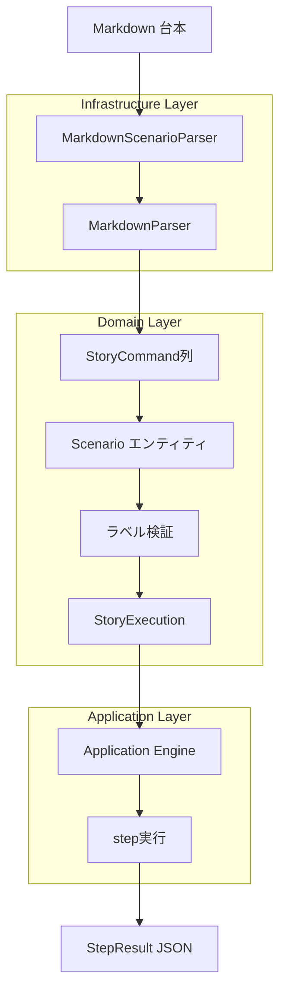

### エンジン実行サイクル

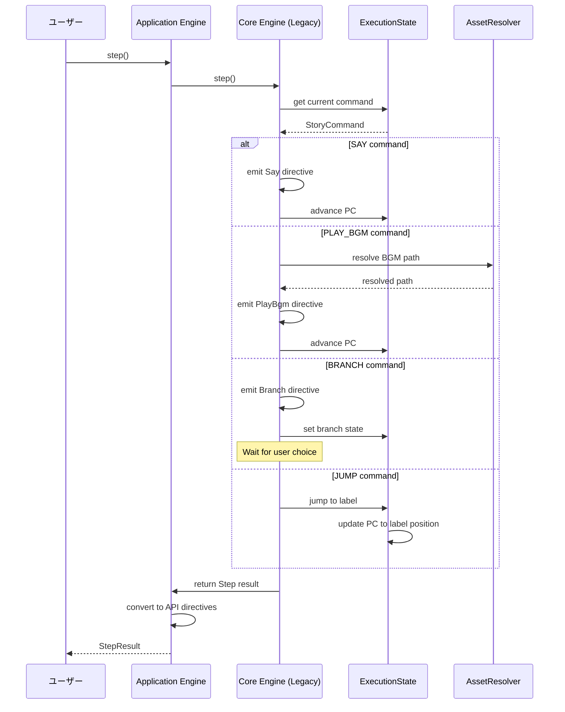

## 分岐処理フロー

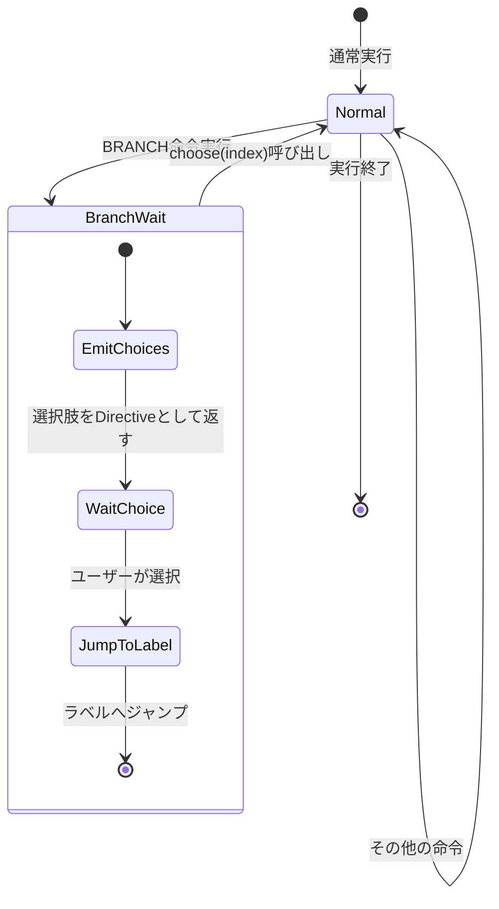

### 分岐選択詳細フロー

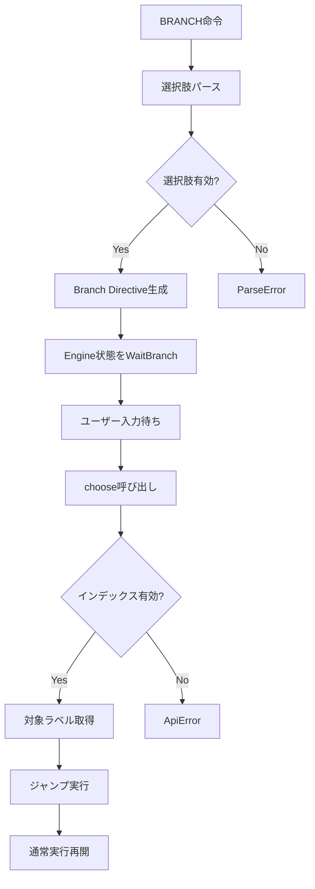

## 変数管理フロー

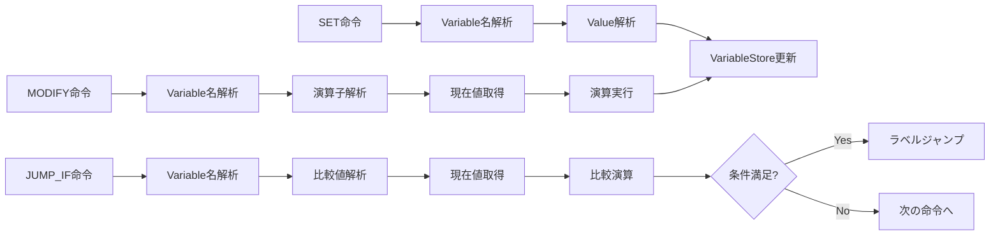

## エラーハンドリングフロー

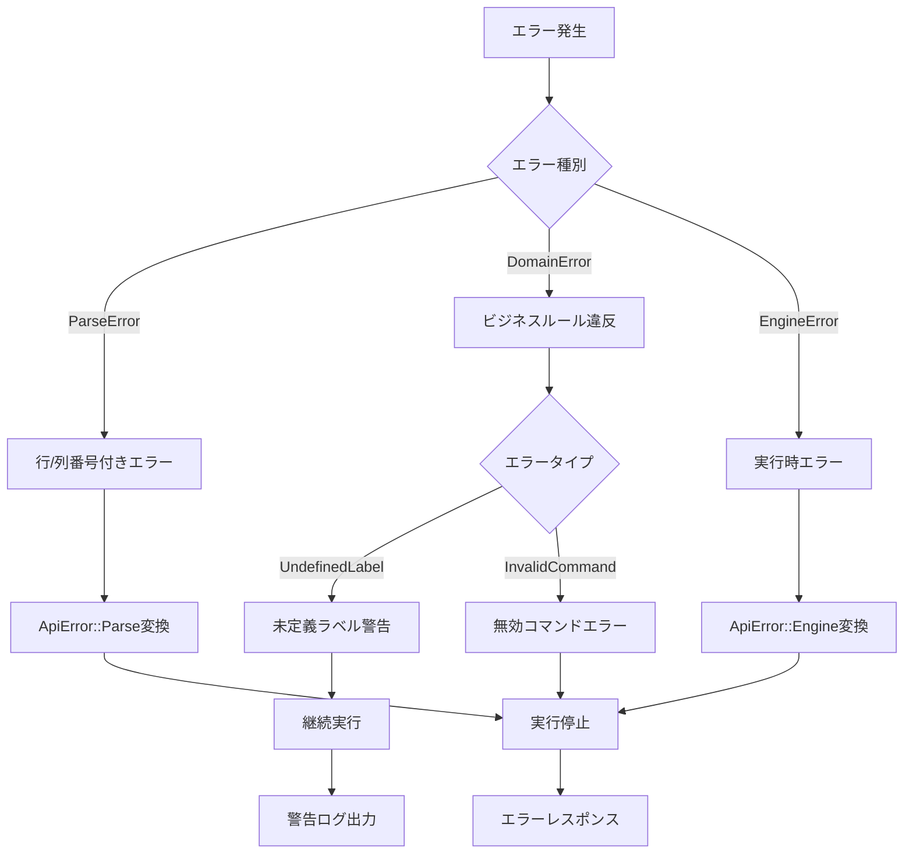

## アセット解決フロー

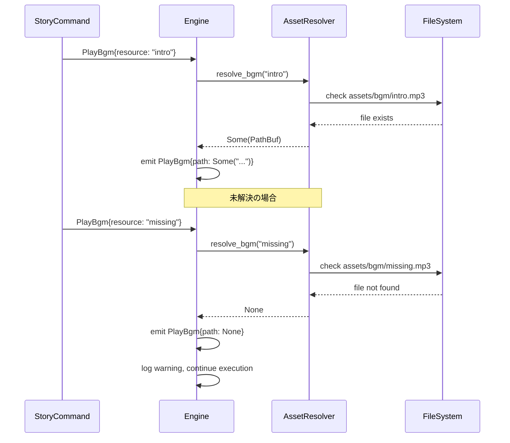

## 状態管理フロー

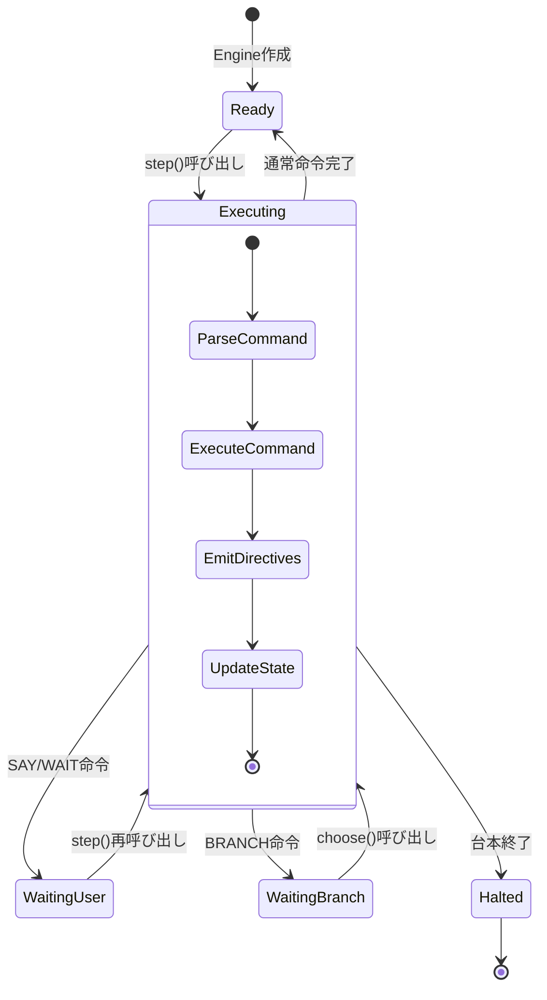

### ExecutionState 詳細フロー

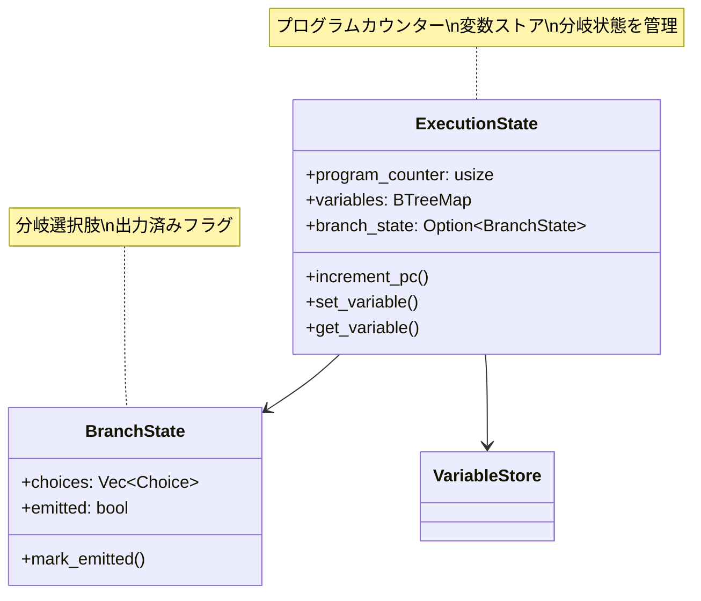

## パフォーマンス特性

### メモリ使用パターン
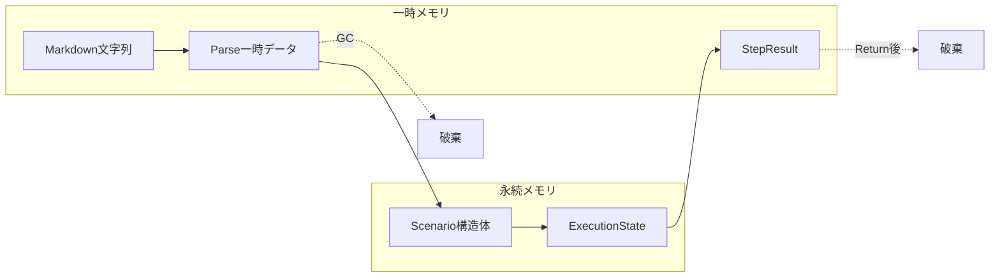

### 実行時コスト
- **パース**: O(n) - 台本行数に比例
- **ラベル検索**: O(log n) - BTreeMap使用
- **変数アクセス**: O(log v) - 変数数に比例
- **命令実行**: O(1) - 定数時間

## 同期・非同期処理

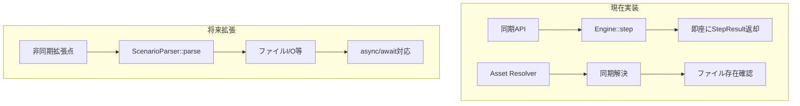

## データ整合性保証

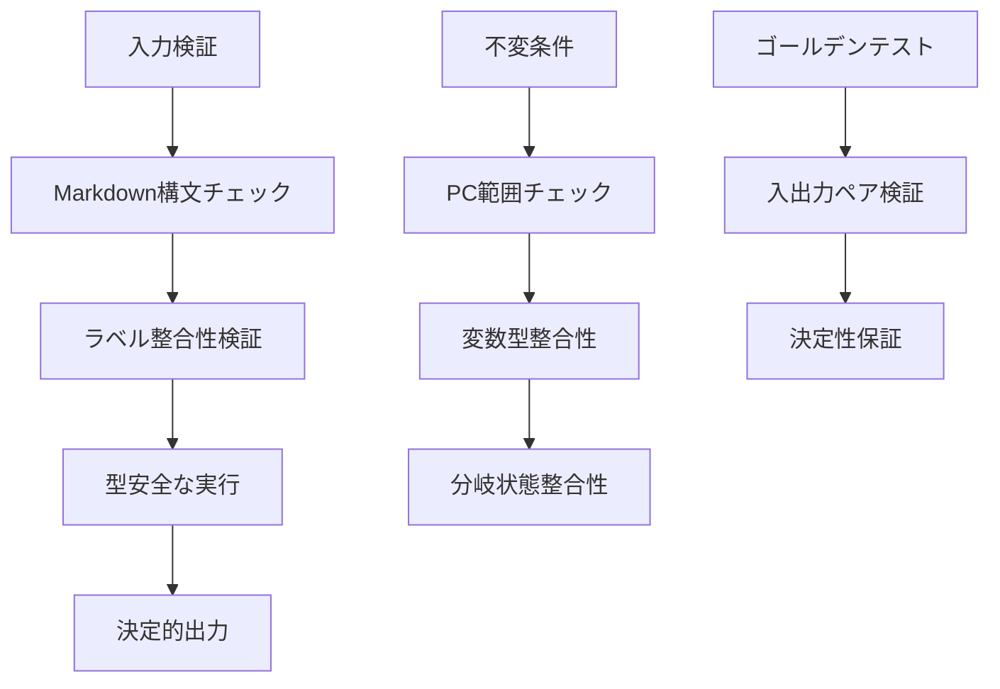

この設計により、tsumugaiは「Markdown台本→決定的StepResult」の変換を安全かつ効率的に実行し、各レイヤーの責務を明確に分離しています。